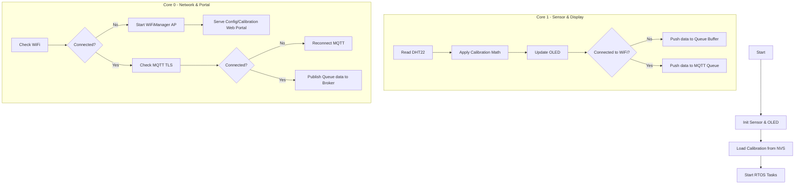

# ESP32 Thermohygro dengan Kalibrasi Multi-Titik & MQTT (EMQX)

Proyek ini adalah implementasi sistem pemantau suhu dan kelembapan (Thermohygrometer) berbasis ESP32 dan sensor DHT22. Data yang dibaca dari sensor ditampilkan secara lokal pada layar OLED dan dikirim secara real-time ke broker MQTT (EMQX) menggunakan koneksi TLS/SSL yang aman.

Sistem ini dirancang sangat andal karena memanfaatkan **FreeRTOS** untuk memisahkan tugas pembacaan sensor dan komunikasi jaringan pada core yang berbeda. Selain itu, terdapat fitur unggulan **Kalibrasi Multi-Titik via Web Portal** dan **Sistem Buffer Offline** yang akan menyimpan data saat jaringan terputus.

## Fitur Utama

- **Dual-Core Processing (FreeRTOS):** 
  - **Core 0:** Menangani koneksi WiFi, manajemen antrean (queue), Web Portal (WiFiManager), dan koneksi MQTT (MQTTS).
  - **Core 1:** Fokus untuk membaca sensor secara presisi, menghitung interpolasi kalibrasi, dan memperbarui layar OLED tanpa hambatan.
- **Kalibrasi Multi-Titik (Linear Interpolation):** Sistem kalibrasi hingga 4 titik untuk suhu dan kelembapan agar nilai pembacaan sensor lebih akurat dan sesuai dengan alat ukur standar (misal: GFTB 200). Data kalibrasi disimpan secara permanen di NVS (Non-Volatile Storage).
- **Web Portal Konfigurasi (WiFiManager):** Memudahkan pengaturan WiFi dan parameter kalibrasi melalui antarmuka web saat ESP32 berada dalam mode Access Point (AP).
- **Secure MQTT (TLS/SSL):** Mengirim data menggunakan enkripsi (Port 8883) dengan sertifikat CA `DigiCert Global Root G2`.
- **Data Buffering Offline:** Jika koneksi internet terputus, data sensor akan terus dibaca dan dimasukkan ke dalam antrean (Queue) berkapasitas 120 data. Ketika internet kembali terhubung, semua data dalam antrean akan dikirim sekaligus.
- **Tombol Fisik Mode Kalibrasi:** Tekan tombol (terhubung ke GPIO 14) untuk berpindah ke mode kalibrasi secara instan tanpa perlu mematikan alat.

## Kebutuhan Hardware

1. Modul ESP32
2. Sensor Suhu & Kelembapan DHT22 (Pin Data ke GPIO 4)
3. Layar OLED 0.96" 128x64 I2C (SSD1306)
4. Push Button untuk masuk ke mode kalibrasi (Pin ke GPIO 14 dan GND)
5. Kabel Jumper

## Library yang Dibutuhkan

Pastikan Anda menginstal pustaka berikut di Arduino IDE Anda:

- [Adafruit GFX Library](https://github.com/adafruit/Adafruit-GFX-Library)
- [Adafruit SSD1306](https://github.com/adafruit/Adafruit_SSD1306)
- [DHT sensor library](https://github.com/adafruit/DHT-sensor-library) oleh Adafruit
- [WiFiManager](https://github.com/tzapu/WiFiManager) oleh tzapu
- [PubSubClient](https://github.com/knolleary/pubsubclient) oleh Nick O'Leary

## Struktur File

- `esp_thermohygro.ino` - File program utama berisi fungsi Setup, Loop, dan Task untuk FreeRTOS.
- `config.h` - Pengaturan kredensial MQTT, topik, pin hardware, dan Root CA Certificate.
- `calibration.h` - Logika penyimpanan NVS (Preferences) dan perhitungan interpolasi linear untuk kalibrasi.
- `network_manager.h` - Menangani konektivitas WiFi, MQTT, Web Portal (WiFiManager), dan halaman pengaturan kalibrasi.

## Cara Penggunaan

1. **Konfigurasi Awal:**
   Buka file `config.h` dan sesuaikan parameter server MQTT EMQX (Host, Port, Username, Password, dan Topik).
2. **Upload Program:**
   Pilih board ESP32 di Arduino IDE dan upload program.
3. **Mode Kalibrasi & Setup WiFi:**
   - Pada saat pertama kali dinyalakan atau tidak ada koneksi WiFi, ESP32 akan memancarkan sinyal WiFi Access Point (AP) dengan format nama `CALIB-ESP32-XXXXXX`.
   - Hubungkan HP atau Laptop Anda ke WiFi tersebut.
   - Buka browser dan akses alamat IP `192.168.4.1` (biasanya akan terbuka otomatis melalui Captive Portal).
   - Atur WiFi rumah/kantor Anda dan masukkan parameter kalibrasi pada menu "Menu Kalibrasi (Suhu & RH)".
   - Anda juga dapat memicu mode ini secara manual kapan saja dengan menekan tombol yang terhubung pada GPIO 14.
4. **Pemantauan (Monitoring):**
   - Setelah terkoneksi internet, alat akan otomatis mengunggah data pembacaan ke broker MQTT.
   - Layar OLED akan menampilkan Suhu terkalibrasi, Kelembapan terkalibrasi, dan status antrean data (`Q:`) jika data gagal terkirim dan disimpan sementara di buffer.

## Diagram Alur Sederhana

